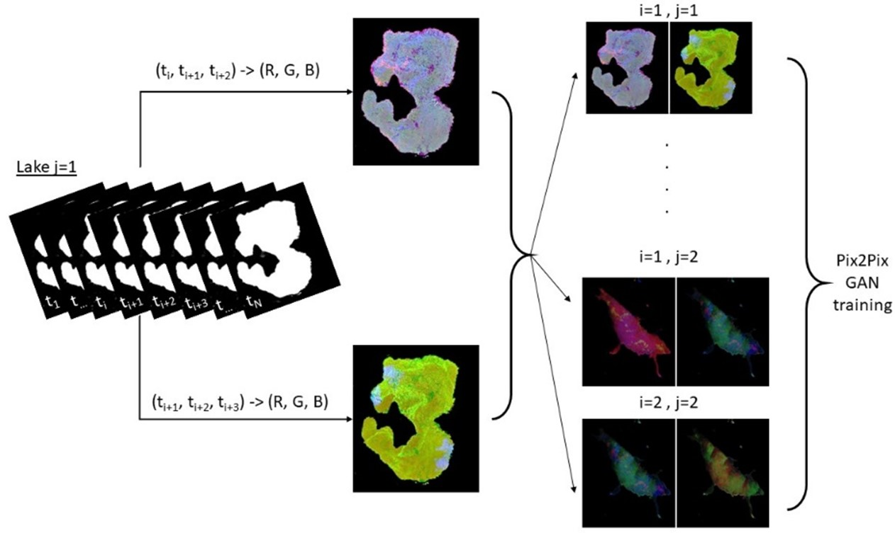

# Forecasting Lakes’ Chlorophyll Concentrations Using Satellite Images and Generative Adversarial Networks

This is the python implementation of the models presented in "Forecasting Lakes’ Chlorophyll Concentrations Using Satellite Images and Generative Adversarial Networks" paper by the Nikolaos Nagkoulis, Giorgos Vasiloudis, Anastasia Moumtzidou, Ilias Gialampoukidis, Stefanos Vrochidis, and Ioannis Kompatsiaris. 

This paper introduces a Generative Adversarial Network model that can be used to forecast Chlorophyll-α (Chl-α) values in water bodies

The work is based on the the fact that typically Chl-α increases and decreases periodically. First, we apply C2RCC, which is a common atmospheric correction algorithm, to Sentinel-2 images to get Chl-α maps for 15 lakes for 12 consecutive months around Europe. Then, we use this dataset (1000 Sentinel-2 images) to train a Generative Adversarial Network (GAN) to recognize spatiotemporal patterns. To accomplish this task, pix2pix algorithm is employed, matching consecutive past and current Chl-α maps to future Chl-α maps. This model has been applied to 3 water bodies around Europe that are not included in the 15-lakes training dataset and has been found to perform accurately, achieving high Pearson and Spearman correlations and low RMSE values. 

> Read more about Conditional Generative Adversarial Network (cGAN) called pix2pix in the original paper ["Attention is all you need"](https://cacm.acm.org/magazines/2020/11/248222-generative-adversarial-networks/fulltext) and this educational [blog post](https://www.tensorflow.org/tutorials/generative/pix2pix).

The following figure illustrates an overview of the proposed method:

 

Other details:
* Chl-α values are being calculated using the C2RCC model. [link](https://ui.adsabs.harvard.edu/abs/2016ESASP.740E..54B/abstract)  

### Cite as:
Pending

### Acknowledgements
This research has received support from the EU’s Horizon 2020 research and innovation programme under grant agreement H2020-883484, known as PathoCERT.
